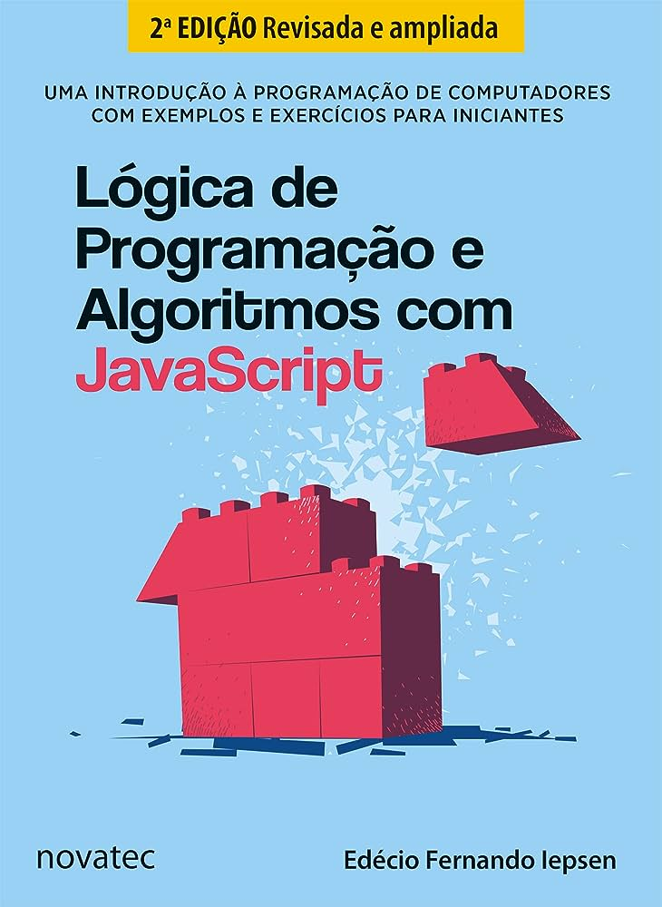

# Lógica de Programação e Algoritmos com JavaScript



Este é o repositório de exercícios do livro **"Lógica de Programação e Algoritmos com JavaScript"** publicado pela editora Novatec. Este livro foi escrito para ajudar iniciantes e programadores em início de carreira a compreender e praticar conceitos fundamentais de lógica de programação e algoritmos usando a linguagem **JavaScript**.

**Obs**: Como o livro foca em ensinar **JavaScript** eu adaptei todos os exercícios para rodar em javascrfipt puro no terminal, vale ressaltar que o exercício "a" do **capítulo 9** não foi feito, pois, seu foco é contar a quantidade de acessos no site, os do **capítulo 10** tampem não foram feitos porque são de injeção de **html** via **JavaScript**.

Resoluções das questões e exemplos do livro **_Lógica de programação e Algoritmos com JavaScript_** da Editora NOVATEC; Autor: Edécio Fernando Iepsen.

###  Instalação e Execução do Projeto

Clone este repositório

```
> git clone https://github.com/Mar0la/Logica-de-programacao-e-algoritmos-com-javascript-novatec
```

Instale as dependências com o npm

```
npm install
```

- Navegue até cada arquivo. ⬇️ Exemplo ⬇️

```
> node .\cap1\resp_a
```


## Contribuições
Este repositório é mantido como um recurso complementar para os leitores do livro. Se você encontrar erros, tiver sugestões de melhoria ou quiser contribuir com exemplos de código ou exercícios adicionais, sinta-se à vontade para fazer um fork deste repositório e enviar suas contribuições através de pull requests.

##

As resoluções Oficiais feitas pelo autor do livro podem ser baixadas clicando em **_EXEMPLOS DO LIVRO_** na aba **_SUPORTE_** no [SITE OFICIAL DA NOVATEC](https://novatec.com.br/livros/logica-programacao-algoritmos-com-javascript/).

## Questões por Capítulo

**Capítulo 1** - **_Lógica de programação_**

[Sucessor/Antecessor](https://github.com/Mar0la/Logica-de-programacao-e-algoritmos-com-javascript-novatec/blob/main/cap1/resp_a.js)

[Pizzaria](https://github.com/Mar0la/Logica-de-programacao-e-algoritmos-com-javascript-novatec/blob/main/cap1/resp_b.js)

[Descontos](https://github.com/Mar0la/Logica-de-programacao-e-algoritmos-com-javascript-novatec/blob/main/cap1/resp_c.js)

[Media-Nota](https://github.com/Mar0la/Logica-de-programacao-e-algoritmos-com-javascript-novatec/blob/main/cap1/resp_d.js)

##
**Capítulo 2** - **_Integração com HTML_**

[Farmácia](https://github.com/Mar0la/Logica-de-programacao-e-algoritmos-com-javascript-novatec/blob/main/cap2/resp_a.js)

[Lan House](https://github.com/Mar0la/Logica-de-programacao-e-algoritmos-com-javascript-novatec/blob/main/cap2/resp_b.js)

[Supermercado](https://github.com/Mar0la/Logica-de-programacao-e-algoritmos-com-javascript-novatec/blob/main/cap2/resp_c.js)

##
**Capítulo 3** - **Construção de algoritmos com Node.js**
- **Onde aprendemos a usar node.js e rodar os programas no terminal.** 
##

**Capítulo 4** - **_Condicionais_**

[Verifica Velocidade](https://github.com/Mar0la/Logica-de-programacao-e-algoritmos-com-javascript-novatec/blob/main/cap4/resp_a.js)

[Parquímetro](https://github.com/Mar0la/Logica-de-programacao-e-algoritmos-com-javascript-novatec/blob/main/cap4/resp_b.js)

[Lados do Triângulo](https://github.com/Mar0la/Logica-de-programacao-e-algoritmos-com-javascript-novatec/blob/main/cap4/resp_c.js)

##
**Capítulo 5** - **_Repetições_**

[Repete Fruta](https://github.com/Mar0la/Logica-de-programacao-e-algoritmos-com-javascript-novatec/blob/main/cap5/resp_a.js);

[Criação de Chinchilas](https://github.com/Mar0la/Logica-de-programacao-e-algoritmos-com-javascript-novatec/blob/main/cap5/resp_b.js)

[Números Perfeitos](https://github.com/Mar0la/Logica-de-programacao-e-algoritmos-com-javascript-novatec/blob/main/cap5/resp_c.js)

##

**Capítulo 6** - **_Arrays / Vetores_**

[Jogos Eliminatórios](https://github.com/Mar0la/Logica-de-programacao-e-algoritmos-com-javascript-novatec/blob/main/cap6/resp_a.js)

[Números em Ordem](https://github.com/Mar0la/Logica-de-programacao-e-algoritmos-com-javascript-novatec/blob/main/cap6/resp_b.js)

[Programa Concurso](https://github.com/Mar0la/Logica-de-programacao-e-algoritmos-com-javascript-novatec/blob/main/cap6/resp_c.js)

##

**Capítulo 7** - **_Strings e Datas_**

[Programa Criptografia](https://github.com/Mar0la/Logica-de-programacao-e-algoritmos-com-javascript-novatec/blob/main/cap7/resp_a.js)

[Palíndromo](https://github.com/Mar0la/Logica-de-programacao-e-algoritmos-com-javascript-novatec/blob/main/cap7/resp_b.js)

[Multa de Trânsito](https://github.com/Mar0la/Logica-de-programacao-e-algoritmos-com-javascript-novatec/blob/main/cap7/resp_c.js)

##
**Capítulo 8** - **_Funções e eventos_**

[Clube de Natação](https://github.com/Mar0la/Logica-de-programacao-e-algoritmos-com-javascript-novatec/blob/main/cap8/resp_a.js)

[Senha Inicial](https://github.com/Mar0la/Logica-de-programacao-e-algoritmos-com-javascript-novatec/blob/main/cap8/resp_b.js)

[Veterinária](https://github.com/Mar0la/Logica-de-programacao-e-algoritmos-com-javascript-novatec/blob/main/cap8/resp_c.js)

##
**Capítulo 9** - **_Funções e eventos_**

[Compras da Semana](https://github.com/Mar0la/Logica-de-programacao-e-algoritmos-com-javascript-novatec/blob/main/cap9/resp_b.js)

[Controle de Serviçoes](https://github.com/Mar0la/Logica-de-programacao-e-algoritmos-com-javascript-novatec/blob/main/cap9/resp_c.js)

##